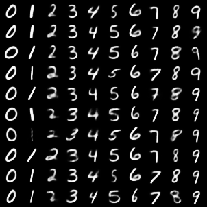
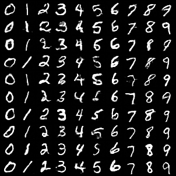

# Report
## EBM
Corrupted image:

Recovered image:

Corruption MSE: 0.0633905683517456

Recovered MSE: 0.03081736822128296

## Flow

Corrupted image:

Recovered image:

Corruption MSE: 51.910425390625

Recovered MSE: 29.597753857421875

## VAE

| Number | FID Score |
|--------|-----------|
| 0 | 0.04455895349383354 | 12.125177 
| 1 | 0.026823054999113083 | 11.195983
| 2 | 0.051463156938552856 |  20.237507 
| 3 | 0.04539191722869873 | 14.085432
| 4 | 0.040382642298936844 |  27.715439
| 5 | 0.04383436590433121 |  20.74887 
| 6 | 0.04418477043509483 |  13.957069
| 7 | 0.037287671118974686 |  22.50258
| 8 | 0.04840046912431717 |    27.213556 
| 9 | 0.04168086126446724 |  12.610439

## GAN

The standard deviations and FID scores are shown below.

| Number | Standard Deviation | FID Score |
|--------|--------------------|-----------|
| 0 | 0.1787097454071045  | 4.9085546
| 1 | 0.09217647463083267  |  4.224687 
| 2 | 0.17962639033794403  |  6.9362025
| 3 | 0.1663513481616974  |  5.9976068 
| 4 | 0.153755784034729  | 4.0131826
| 5 | 0.16236311197280884  |  6.427882 
| 6 | 0.1616886407136917  |  5.306947
| 7 | 0.14642734825611115  | 6.5232377 
| 8 | 0.1611669808626175  | 7.2798767
| 9 | 0.13812598586082458  |  6.026694
  

